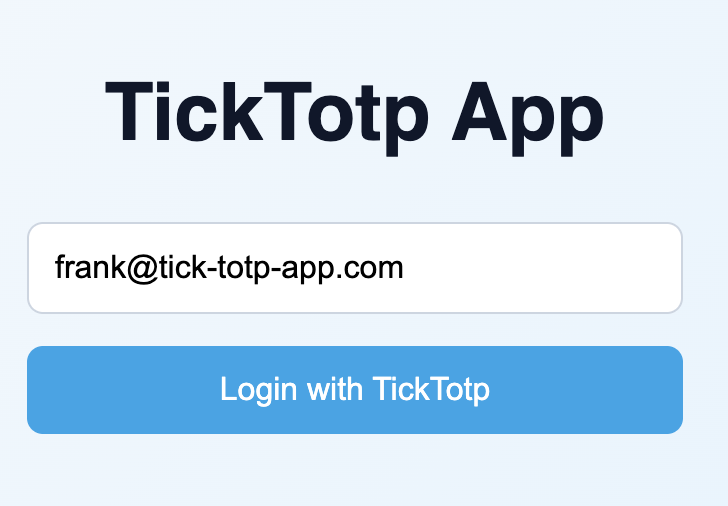
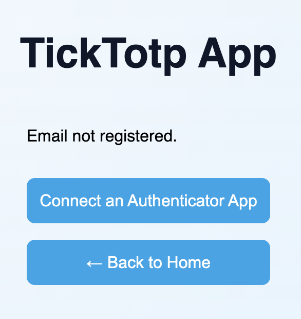
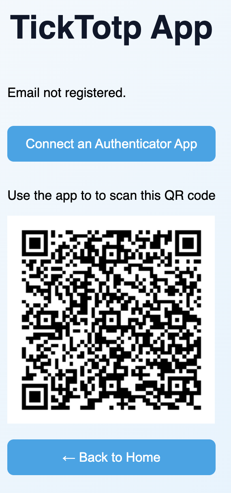
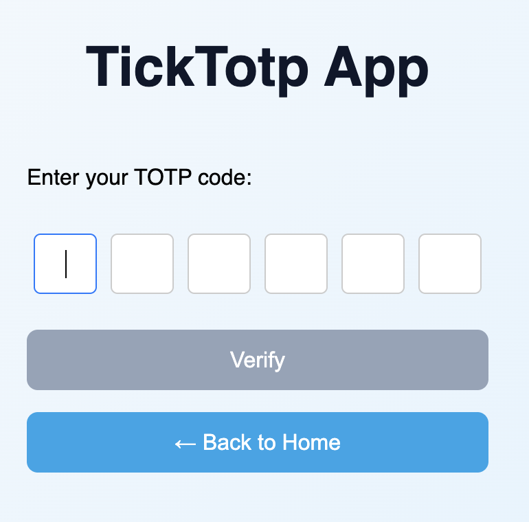
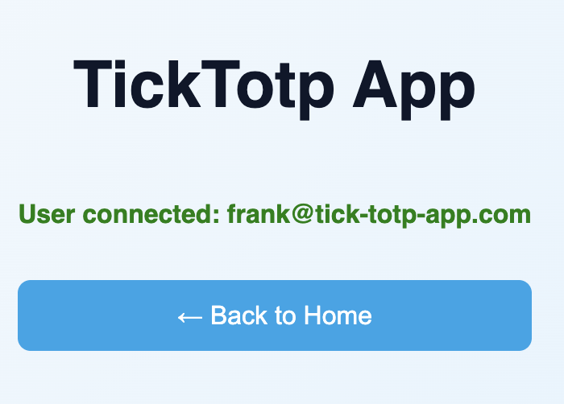

# TickTOTP 🔐

A modern Time-Based One-Time Password (TOTP) generator and verifier with a Go backend API and React frontend.

## Features

- ✨ Generate secure TOTP codes
- ✅ Verify TOTP codes with Redis-backed storage
- 🐳 Full Docker Compose deployment
- 🚀 RESTful API with CORS support
- ⚡ Fast and lightweight Go backend
- 🎨 Modern React frontend with Tailwind CSS

## Screenshots

### User Authentication Flow

<table>
  <tr>
    <td><br/><b>First Time User</b><br/>Prompt to connect authenticator app</td>
    <td><br/><b>QR Code Pairing</b><br/>Scan with authenticator app</td>
    <td><br/><b>TOTP Code Entry</b><br/>Enter 6-digit verification code</td>
  </tr>
  <tr>
    <td><br/><b>Login Screen</b><br/>Enter email to begin authentication</td>
    <td><br/><b>Successful Authentication</b><br/>User connected confirmation</td>
    <td></td>
  </tr>
</table>

## Architecture

```
┌──────────────┐     ┌──────────────┐     ┌──────────────┐
│   React      │────▶│   Go API     │────▶│    Redis     │
│   Frontend   │     │   (Port 3000)│     │  (Port 6379) │
│  (Port 8080) │     └──────────────┘     └──────────────┘
└──────────────┘
```

## How It Works

1. **User Login** - Enter your email address
2. **First Time Setup** - If not registered, scan QR code with your authenticator app (Google Authenticator, Authy, etc.)
3. **Generate Code** - Your authenticator app generates a 6-digit TOTP code
4. **Verify** - Enter the code to complete authentication
5. **Success** - You're authenticated and connected!

## Quick Start

### Prerequisites

- Docker and Docker Compose
- (Optional) Go 1.21+ for local development
- (Optional) Node.js 18+ for frontend development

### Running with Docker Compose

```bash
# Clone the repository
git clone https://github.com/fdruillennec/ticktotp.git
cd ticktotp

# Start all services
docker-compose up -d --build

# Check service status
docker-compose ps

# View logs
docker-compose logs -f
```

### Accessing the Application

- **Frontend**: http://localhost:8080
- **API**: http://localhost:3000
- **Redis**: localhost:6379

### Stopping Services

```bash
# Stop all services
docker-compose down

# Stop and remove volumes (clean slate)
docker-compose down -v
```

## API Endpoints

### Generate TOTP
```bash
POST /generate
Content-Type: application/json

{
  "email": "user@example.com"
}

Response:
{
  "secret": "BASE32_ENCODED_SECRET",
  "otpauth_url": "otpauth://totp/TickTOTP:EMAIL?algorithm=SHA1\u0026digits=6\u0026issuer=TickTOTP\u0026period=30\u0026secret=BASE32_ENCODED_SECRET"
  "qr_code": "data:image/png;base64,..."
}
```

### Verify TOTP
```bash
POST /verify
Content-Type: application/json

{
  "email": "user@example.com",
  "token": "123456"
}

Response:
{
  "valid": true,
}
```

### User Check
```bash
GET /status

Response:
{
  "status": "ok"
}
```

## Development

### Backend Development (Go)

```bash
cd ticktotp-api

# Install dependencies
go mod download

# Run locally (requires Redis running)
go run main.go

# Run tests
go test ./...

# Build binary
go build -o bin/totp-api
```

### Frontend Development (React)

```bash
cd ticktotp-frontend

# Install dependencies
npm install

# Run development server
npm run dev

# Build for production
npm run build
```

## Project Structure

```
ticktotp/
├── docker-compose.yaml          # Container orchestration
├── screenshots/                # Application screenshots
├── ticktotp-api/               # Go backend
│   ├── handlers/               # HTTP request handlers
│   ├── redis/                  # Redis client
│   ├── utils/                  # Utility functions (TOTP generation)
│   ├── main.go                 # Application entry point
│   ├── go.mod                  # Go dependencies
│   └── Dockerfile              # API container image
└── ticktotp-frontend/          # React frontend
    ├── src/                    # Source files
    ├── public/                 # Static assets
    └── Dockerfile              # Frontend container image
```

## Configuration

### Environment Variables

**API Service:**
- `REDIS_ADDR`: Redis connection address (default: `redis:6379`)
- `PORT`: API server port (default: `3000`)

**Frontend Service:**
- `VITE_API_URL`: Backend API URL (default: `http://localhost:3000`)

## Security Considerations

- 🔒 TOTP codes expire after 30 seconds
- 🛡️ Redis persistence ensures code validation
- ⚠️ **Production**: Update CORS settings in `main.go` to restrict allowed origins
- 🔐 **Production**: Use environment variables for sensitive configuration
- 🚨 **Production**: Enable HTTPS/TLS for all endpoints
- 🔑 **Production**: Implement rate limiting on verification endpoints

For more security best practices, see [SECURITY.md](SECURITY.md).

## Contributing

Contributions are welcome! Please feel free to submit a Pull Request.

1. Fork the repository
2. Create your feature branch (`git checkout -b feature/amazing-feature`)
3. Commit your changes (`git commit -m 'feat: add amazing feature'`)
4. Push to the branch (`git push origin feature/amazing-feature`)
5. Open a Pull Request

For detailed guidelines, see [CONTRIBUTING.md](CONTRIBUTING.md).

## Changelog

See [CHANGELOG.md](CHANGELOG.md) for a detailed history of changes and releases.

## License

This project is licensed under the MIT License - see the [LICENSE](LICENSE) file for details.

## Acknowledgments

- Built with [rs/cors](https://github.com/rs/cors) for CORS middleware
- TOTP implementation using Go standard libraries
- Redis for persistent storage
- React with Vite for modern frontend
- Tailwind CSS for styling

## Support

If you encounter any issues or have questions, please [open an issue](https://github.com/fdruillennec/ticktotp/issues).
